# 🎓 Demo Kubernetes na AWS - FIAP POS Tech

[](https://dotnet.microsoft.com/)
[](https://kubernetes.io/)
[](https://aws.amazon.com/eks/)
[](https://www.docker.com/)
[](LICENSE)

> **Projeto educacional para demonstração de deploy de aplicações .NET no Kubernetes (AWS EKS)**  
> Desenvolvido para o curso de **Arquitetura de Sistemas .NET** da **FIAP POS Tech**

---

## 📋 Sobre o Projeto

Este repositório contém uma aplicação .NET 8 (API REST) completa, pronta para ser deployada no Kubernetes usando Amazon EKS. O projeto foi desenvolvido especificamente para aulas hands-on, com foco em ensinar conceitos de containerização, orquestração e cloud computing.

### 🎯 Objetivos Educacionais

- Demonstrar containerização de aplicações .NET
- Ensinar conceitos de Kubernetes na prática
- Mostrar integração com serviços AWS (EKS, ECR)
- Apresentar boas práticas de deploy e operação
- Introduzir conceitos de auto scaling e monitoramento

---

## 🏗️ Arquitetura

```mermaid
graph TB
    subgraph AWS["☁️ AWS Cloud"]
        subgraph ECR["📦 Amazon ECR"]
            IMG["🐳 fiapstore-api:latest<br/>Container Image"]
        end
        
        subgraph EKS["☸️ Amazon EKS Cluster"]
            subgraph VPC["🌐 VPC"]
                subgraph NodeGroup["🖥️ Node Group (t3.medium)"]
                    NODE1["Node 1"]
                    NODE2["Node 2"]
                end
                
                subgraph NS["📦 Namespace: fiap-store"]
                    subgraph Resources["Kubernetes Resources"]
                        CM["⚙️ ConfigMap<br/>fiapstore-config"]
                        
                        subgraph Deploy["🚀 Deployment"]
                            POD1["Pod 1<br/>fiapstore-api"]
                            POD2["Pod 2<br/>fiapstore-api"]
                            POD3["Pod 3<br/>fiapstore-api"]
                        end
                        
                        SVC["🔀 Service<br/>LoadBalancer<br/>Port 80"]
                        HPA["📊 HPA<br/>Min: 2 | Max: 10<br/>Target: 50% CPU"]
                    end
                end
                
                LB["⚖️ AWS Load Balancer<br/>External IP"]
            end
        end
    end
    
    USER["👤 Usuário"] -->|HTTP Request| LB
    LB -->|Route Traffic| SVC
    SVC -->|Distribute| POD1
    SVC -->|Distribute| POD2
    SVC -->|Distribute| POD3
    
    CM -.->|Environment Vars| POD1
    CM -.->|Environment Vars| POD2
    CM -.->|Environment Vars| POD3
    
    HPA -.->|Monitor & Scale| Deploy
    
    IMG -.->|Pull Image| POD1
    IMG -.->|Pull Image| POD2
    IMG -.->|Pull Image| POD3
    
    POD1 -.->|Running on| NODE1
    POD2 -.->|Running on| NODE1
    POD3 -.->|Running on| NODE2
    
    style AWS fill:#FF9900,stroke:#232F3E,stroke-width:3px,color:#fff
    style EKS fill:#326CE5,stroke:#fff,stroke-width:2px,color:#fff
    style ECR fill:#FF9900,stroke:#fff,stroke-width:2px,color:#fff
    style NS fill:#326CE5,stroke:#fff,stroke-width:2px,color:#fff
    style Deploy fill:#4CAF50,stroke:#fff,stroke-width:2px,color:#fff
    style POD1 fill:#2196F3,stroke:#fff,stroke-width:2px,color:#fff
    style POD2 fill:#2196F3,stroke:#fff,stroke-width:2px,color:#fff
    style POD3 fill:#2196F3,stroke:#fff,stroke-width:2px,color:#fff
    style SVC fill:#9C27B0,stroke:#fff,stroke-width:2px,color:#fff
    style LB fill:#FF5722,stroke:#fff,stroke-width:2px,color:#fff
    style HPA fill:#FF9800,stroke:#fff,stroke-width:2px,color:#fff
    style CM fill:#607D8B,stroke:#fff,stroke-width:2px,color:#fff
```



### 📋 Componentes da Arquitetura

#### AWS Services
- **Amazon EKS**: Kubernetes gerenciado
- **Amazon ECR**: Registry privado de containers
- **AWS Load Balancer**: Balanceamento de carga externo
- **VPC**: Rede isolada para o cluster

#### Kubernetes Resources
- **Namespace**: `fiap-store` (isolamento lógico)
- **Deployment**: 3 réplicas da aplicação
- **Service**: LoadBalancer (expõe a aplicação)
- **ConfigMap**: Variáveis de ambiente
- **HPA**: Auto scaling (2-10 pods)

#### Nodes
- **Tipo**: t3.medium (2 vCPU, 4GB RAM)
- **Quantidade**: 2 nodes
- **OS**: Amazon Linux 2

### 🔄 Fluxo de Deploy

```mermaid
sequenceDiagram
    participant Dev as 👨‍💻 Desenvolvedor
    participant Docker as 🐳 Docker
    participant ECR as 📦 ECR
    participant K8s as ☸️ Kubernetes
    participant Pod as 🎯 Pod
    participant User as 👤 Usuário
    
    Dev->>Docker: 1. docker build (AMD64)
    Docker->>Docker: 2. Build multi-stage
    Dev->>ECR: 3. docker push
    ECR->>ECR: 4. Store image
    
    Dev->>K8s: 5. kubectl apply -f k8s/
    K8s->>K8s: 6. Create resources
    K8s->>ECR: 7. Pull image
    ECR->>K8s: 8. Return image
    K8s->>Pod: 9. Create pods (3x)
    Pod->>Pod: 10. Health checks
    Pod->>K8s: 11. Ready
    K8s->>K8s: 12. Create LoadBalancer
    
    User->>K8s: 13. HTTP Request
    K8s->>Pod: 14. Route to pod
    Pod->>User: 15. Response
```



---

## 🚀 Tecnologias Utilizadas

### Backend
- **.NET 8** - Framework principal
- **ASP.NET Core** - Web API
- **Minimal APIs** - Endpoints modernos
- **Swagger/OpenAPI** - Documentação da API

### Containerização
- **Docker** - Containerização
- **Multi-stage builds** - Otimização de imagens
- **Amazon ECR** - Registry de containers

### Orquestração
- **Kubernetes** - Orquestração de containers
- **Amazon EKS** - Kubernetes gerenciado
- **kubectl** - CLI do Kubernetes

### Recursos Kubernetes
- **Deployment** - Gerenciamento de réplicas
- **Service (LoadBalancer)** - Exposição da aplicação
- **ConfigMap** - Configurações
- **HPA** - Auto scaling horizontal
- **Probes** - Health checks

---

## 📁 Estrutura do Projeto

```
demo-k8s-cloud-aws-net-fiap/
├── src/
│   └── FiapStore.Api/
│       ├── Program.cs              # Código principal da API
│       ├── FiapStore.Api.csproj    # Arquivo de projeto
│       └── appsettings.json        # Configurações
├── k8s/
│   ├── namespace.yaml              # Namespace do Kubernetes
│   ├── configmap.yaml              # Configurações da aplicação
│   ├── deployment.yaml             # Deployment com 3 réplicas
│   ├── service.yaml                # Service LoadBalancer
│   └── hpa.yaml                    # Horizontal Pod Autoscaler
├── docs/
│   ├── ALUNOS-HANDS-ON.md         # 📖 Guia completo (CLI + Console)
│   ├── COMANDOS-RAPIDOS.md         # ⚡ Cheat sheet
│   └── CONSOLE-AWS-GUIDE.md        # 🌐 Guia via Console AWS
├── Dockerfile                      # Multi-stage build otimizado
├── .dockerignore                   # Arquivos ignorados no build
├── .gitignore                      # Arquivos ignorados no Git
└── README.md                       # Este arquivo
```

---

## 🎯 Funcionalidades da API

### Endpoints Disponíveis

| Método | Endpoint | Descrição |
|--------|----------|-----------|
| GET | `/health` | Health check da aplicação |
| GET | `/info` | Informações do ambiente |
| GET | `/api/produtos` | Lista todos os produtos |
| GET | `/api/produtos/{id}` | Busca produto por ID |
| POST | `/api/produtos` | Cria novo produto |
| PUT | `/api/produtos/{id}` | Atualiza produto |
| DELETE | `/api/produtos/{id}` | Remove produto |
| GET | `/swagger` | Documentação interativa |

### Exemplo de Produto

```json
{
  "id": 1,
  "nome": "Notebook Dell",
  "descricao": "Notebook Dell Inspiron 15",
  "preco": 3500.00,
  "estoque": 10
}
```

---

## 🛠️ Pré-requisitos

### Software Necessário

- [.NET 8 SDK](https://dotnet.microsoft.com/download/dotnet/8.0)
- [Docker Desktop](https://www.docker.com/products/docker-desktop)
- [AWS CLI](https://aws.amazon.com/cli/)
- [kubectl](https://kubernetes.io/docs/tasks/tools/)
- [Git](https://git-scm.com/)

### Acesso AWS

- Conta AWS (Learner Lab da FIAP)
- Credenciais configuradas
- Profile AWS CLI: `fiapaws`

---

## 🚀 Quick Start

### 1. Clonar o Repositório

```bash
git clone https://github.com/seu-usuario/demo-k8s-cloud-aws-net-fiap.git
cd demo-k8s-cloud-aws-net-fiap
```

### 2. Testar Localmente

```bash
cd src/FiapStore.Api
dotnet restore
dotnet run

# Em outro terminal
curl http://localhost:5000/health
curl http://localhost:5000/api/produtos
```

### 3. Build e Teste Docker Local

```bash
# Build da imagem para AMD64 (compatível com EKS)
docker buildx build --platform linux/amd64 -t fiapstore-api:latest . --load

# Verificar arquitetura
docker inspect fiapstore-api:latest | grep Architecture

# Executar container
docker run -d -p 8080:8080 --name fiapstore-test fiapstore-api:latest

# Testar
curl http://localhost:8080/health
curl http://localhost:8080/api/produtos

# Parar e remover
docker stop fiapstore-test
docker rm fiapstore-test
```

**⚠️ Importante:** Use `--platform linux/amd64` se estiver em Mac Apple Silicon (M1/M2/M3)

### 4. Deploy no Kubernetes (AWS EKS)

Siga o guia completo em: **[docs/ALUNOS-HANDS-ON.md](docs/ALUNOS-HANDS-ON.md)**

---

## 📚 Documentação

### 📖 Guias Disponíveis

**[ALUNOS-HANDS-ON.md](docs/ALUNOS-HANDS-ON.md)** - Guia Completo para Alunos
- ✅ Passo a passo detalhado (7 partes)
- ✅ Opções via **CLI** e **Console AWS**
- ✅ Teste Docker local antes do push
- ✅ Comandos explicados com contexto
- ✅ Troubleshooting completo
- ✅ Conceitos teóricos integrados
- ⏱️ Tempo estimado: 60-90 minutos

**[COMANDOS-RAPIDOS.md](docs/COMANDOS-RAPIDOS.md)** - Cheat Sheet
- ✅ Todos os comandos organizados por categoria
- ✅ Setup, Docker, ECR, EKS, Deploy, Monitoramento
- ✅ Comandos prontos para copiar/colar
- ✅ Referência rápida durante a aula
- 🎯 Ideal para consulta rápida

**[CONSOLE-AWS-GUIDE.md](docs/CONSOLE-AWS-GUIDE.md)** - Guia via Console AWS
- ✅ Instruções detalhadas passo a passo
- ✅ Alternativa visual ao CLI
- ✅ Screenshots e explicações
- ✅ Criação de ECR, EKS e Node Group
- ✅ Verificação e limpeza de recursos
- 🎯 Ideal para quem prefere interface gráfica

---

## 🔧 Configuração do Ambiente

### AWS CLI Profile

```bash
# Configurar profile fiapaws
aws configure --profile fiapaws

# Definir variáveis de ambiente
export AWS_PROFILE=fiapaws
export AWS_REGION=us-east-1
```

### Variáveis de Ambiente

```bash
export CLUSTER_NAME=fiap-eks-cluster
export ECR_REPO_NAME=fiapstore-api
export AWS_REGION=us-east-1
```

---

## 🐳 Docker

### Build da Imagem

```bash
# Build para AMD64 (compatível com EKS)
docker buildx build --platform linux/amd64 -t fiapstore-api:latest . --load
```

**⚠️ Importante:** Use `--platform linux/amd64` para compatibilidade com nodes EKS

### Executar Container

```bash
docker run -d \
  -p 8080:8080 \
  --name fiapstore \
  fiapstore-api:latest
```

### Push para ECR

```bash
# Login
aws ecr get-login-password --region $AWS_REGION --profile $AWS_PROFILE | \
    docker login --username AWS --password-stdin <ECR_URI>

# Tag
docker tag fiapstore-api:latest <ECR_URI>:latest

# Push
docker push <ECR_URI>:latest
```

---

## ☸️ Kubernetes

### Comandos Básicos

```bash
# Aplicar todos os manifestos
kubectl apply -f k8s/

# Ver recursos
kubectl get all -n fiap-store

# Ver logs
kubectl logs -f <pod-name> -n fiap-store

# Escalar deployment
kubectl scale deployment fiapstore-api --replicas=5 -n fiap-store

# Ver métricas
kubectl top pods -n fiap-store
```

### Acessar a Aplicação

```bash
# Obter URL do LoadBalancer
kubectl get service fiapstore-api-service -n fiap-store

# Testar
curl http://<EXTERNAL-IP>/health
curl http://<EXTERNAL-IP>/api/produtos
```

---

## 📊 Monitoramento

### Health Checks

A aplicação possui três tipos de probes configuradas:

- **Liveness Probe**: Verifica se a aplicação está viva
- **Readiness Probe**: Verifica se está pronta para receber tráfego
- **Startup Probe**: Verifica inicialização

### Métricas

```bash
# Instalar Metrics Server
kubectl apply -f https://github.com/kubernetes-sigs/metrics-server/releases/latest/download/components.yaml

# Ver métricas
kubectl top nodes
kubectl top pods -n fiap-store
```

### Auto Scaling

O HPA está configurado para:
- **Min replicas**: 2
- **Max replicas**: 10
- **Target CPU**: 70%
- **Target Memory**: 80%

---

## 🧪 Testes

### Teste de Carga

```bash
# Usando hey (instalar: brew install hey)
hey -z 60s -c 50 http://<EXTERNAL-IP>/api/produtos

# Observar scaling
kubectl get hpa -n fiap-store --watch
```

### Teste de Health Check

```bash
# Health endpoint
curl http://<EXTERNAL-IP>/health

# Info endpoint
curl http://<EXTERNAL-IP>/info | jq
```

---

## 🧹 Limpeza de Recursos

### ⚠️ IMPORTANTE: Execute ao final para evitar custos!

```bash
# Deletar recursos Kubernetes
kubectl delete -f k8s/

# Deletar node group
aws eks delete-nodegroup \
    --cluster-name $CLUSTER_NAME \
    --nodegroup-name fiap-nodegroup \
    --region $AWS_REGION \
    --profile $AWS_PROFILE

# Deletar cluster
aws eks delete-cluster \
    --name $CLUSTER_NAME \
    --region $AWS_REGION \
    --profile $AWS_PROFILE

# Deletar ECR
aws ecr delete-repository \
    --repository-name $ECR_REPO_NAME \
    --force \
    --region $AWS_REGION \
    --profile $AWS_PROFILE
```

---

## 🎓 Conceitos Aprendidos

### Kubernetes
- ✅ Pods, Deployments, Services
- ✅ ConfigMaps e Secrets
- ✅ Namespaces
- ✅ Health Checks (Probes)
- ✅ Horizontal Pod Autoscaler
- ✅ Resource Limits e Requests
- ✅ Rolling Updates

### AWS
- ✅ Amazon EKS (Elastic Kubernetes Service)
- ✅ Amazon ECR (Elastic Container Registry)
- ✅ IAM Roles e Policies
- ✅ VPC e Networking
- ✅ Elastic Load Balancer

### DevOps
- ✅ Containerização com Docker
- ✅ Multi-stage builds
- ✅ Infrastructure as Code
- ✅ Observabilidade
- ✅ Auto Scaling

---

## 📖 Recursos Adicionais

### Documentação Oficial

- [.NET Documentation](https://learn.microsoft.com/dotnet/)
- [Kubernetes Documentation](https://kubernetes.io/docs/)
- [AWS EKS Documentation](https://docs.aws.amazon.com/eks/)
- [Docker Documentation](https://docs.docker.com/)

### Tutoriais

- [Kubernetes Basics](https://kubernetes.io/docs/tutorials/kubernetes-basics/)
- [AWS EKS Workshop](https://www.eksworkshop.com/)
- [.NET on Kubernetes](https://learn.microsoft.com/dotnet/architecture/containerized-lifecycle/)

### Ferramentas

- [kubectl Cheat Sheet](https://kubernetes.io/docs/reference/kubectl/cheatsheet/)
- [AWS CLI Reference](https://docs.aws.amazon.com/cli/latest/reference/)
- [Docker CLI Reference](https://docs.docker.com/engine/reference/commandline/cli/)

---

#
---

## 👨‍🏫 Sobre o Curso

### FIAP POS Tech - Arquitetura de Sistemas .NET

**Instituição:** [FIAP](https://fiap.com.br)  
**Programa:** [POS Tech](https://postech.fiap.com.br/)  
**Curso:** [Arquitetura de Sistemas .NET](https://postech.fiap.com.br/curso/arquitetura-sistemas-net)

Este projeto foi desenvolvido como material didático para demonstrações práticas de deploy de aplicações .NET em ambientes cloud usando Kubernetes.

---

## 📞 Contato

**Professor:** José Neto  
**Email:** [seu-email]  
**LinkedIn:** [seu-linkedin]  
**GitHub:** [seu-github]

---

<div align="center">

[⬆ Voltar ao topo](#-demo-kubernetes-na-aws---fiap-pos-tech)

</div>
