# 🎓 FIAP POS Tech - Deploy de Aplicação .NET no Kubernetes (AWS EKS)

## 📚 Arquitetura de Sistemas .NET - Aula Prática

**Professor:** José Neto  
**Instituição:** FIAP - POS Tech  
**Curso:** Arquitetura de Sistemas .NET  

---

## 🎯 Objetivos da Aula

Ao final desta aula prática, você será capaz de:

- ✅ Criar e containerizar uma aplicação .NET 8
- ✅ Fazer push de imagens Docker para Amazon ECR
- ✅ Provisionar um cluster Kubernetes na AWS (EKS)
- ✅ Fazer deploy de aplicações .NET no Kubernetes
- ✅ Configurar serviços, ConfigMaps e Auto Scaling
- ✅ Monitorar e validar aplicações em produção

---

## 📋 Pré-requisitos

### ✅ Checklist Antes de Começar

- [ ] Acesso ao **AWS Learner Lab** da FIAP
- [ ] **AWS CLI** instalado e configurado com profile `fiapaws`
- [ ] **kubectl** instalado
- [ ] **Docker** instalado e rodando
- [ ] **.NET 8 SDK** instalado
- [ ] **Git** instalado

### 🔧 Verificação Rápida

Execute os comandos abaixo para verificar se tudo está instalado:

```bash
# Verificar AWS CLI
aws --version

# Verificar kubectl
kubectl version --client

# Verificar Docker
docker --version

# Verificar .NET SDK
dotnet --version

# Verificar Git
git --version
```

---

## 🏗️ Arquitetura da Solução

```mermaid
graph TB
    subgraph AWS["☁️ AWS Cloud"]
        subgraph ECR["📦 Amazon ECR"]
            IMG["🐳 fiapstore-api:latest"]
        end
        
        subgraph EKS["☸️ Amazon EKS"]
            subgraph NS["📦 Namespace: fiap-store"]
                CM["⚙️ ConfigMap"]
                
                subgraph Deploy["🚀 Deployment"]
                    POD1["Pod 1"]
                    POD2["Pod 2"]
                    POD3["Pod 3"]
                end
                
                SVC["🔀 Service<br/>LoadBalancer"]
                HPA["📊 HPA<br/>2-10 pods"]
            end
            
            LB["⚖️ Load Balancer"]
        end
    end
    
    USER["👤 Usuário"] -->|HTTP| LB
    LB --> SVC
    SVC --> POD1
    SVC --> POD2
    SVC --> POD3
    CM -.-> POD1
    CM -.-> POD2
    CM -.-> POD3
    HPA -.->|Scale| Deploy
    IMG -.->|Pull| POD1
    IMG -.->|Pull| POD2
    IMG -.->|Pull| POD3
    
    style AWS fill:#FF9900,stroke:#232F3E,stroke-width:2px
    style EKS fill:#326CE5,stroke:#fff,stroke-width:2px
    style Deploy fill:#4CAF50,stroke:#fff,stroke-width:2px
    style POD1 fill:#2196F3,stroke:#fff
    style POD2 fill:#2196F3,stroke:#fff
    style POD3 fill:#2196F3,stroke:#fff
```



---

## 🚀 PARTE 1: Preparação do Ambiente AWS (10 min)

### 1.1 Acessar o AWS Learner Lab

1. Acesse: https://awsacademy.instructure.com
2. Entre no curso da FIAP
3. Clique em **"Learner Lab"**
4. Clique em **"Start Lab"** (aguarde o indicador ficar verde ●)
5. Clique em **"AWS"** para abrir o console

### 1.2 Configurar AWS CLI com Profile FIAP

```bash
# Obter credenciais temporárias
# No Learner Lab, clique em "AWS Details" > "Show" > "Download PEM"

# Configurar profile fiapaws
aws configure --profile fiapaws
# AWS Access Key ID: [Cole a chave do Learner Lab]
# AWS Secret Access Key: [Cole a secret do Learner Lab]
# Default region name: us-east-1
# Default output format: json

# Adicionar session token (obrigatório para Learner Lab)
aws configure set aws_session_token <SEU_SESSION_TOKEN> --profile fiapaws

# Testar configuração
aws sts get-caller-identity --profile fiapaws
```

### 1.3 Definir Variáveis de Ambiente

```bash
# Definir variáveis para facilitar os comandos
export AWS_PROFILE=fiapaws
export AWS_REGION=us-east-1
export CLUSTER_NAME=fiap-eks-cluster
export ECR_REPO_NAME=fiapstore-api

# Verificar
echo "Profile: $AWS_PROFILE"
echo "Region: $AWS_REGION"
echo "Cluster: $CLUSTER_NAME"
```

---

## 🐳 PARTE 2: Build e Push da Imagem Docker (10 min)

### 2.1 Clonar o Repositório

```bash
# Clonar o projeto (ou usar o projeto fornecido)
cd ~
git clone <URL_DO_REPOSITORIO>
cd demo-k8s-cloud-aws-net-fiap
```

### 2.2 Testar a Aplicação Localmente

```bash
# Restaurar dependências
cd src/FiapStore.Api
dotnet restore

# Executar aplicação
dotnet run

# Em outro terminal, testar
curl http://localhost:5000/health
curl http://localhost:5000/api/produtos

# Parar a aplicação (Ctrl+C)
```

### 2.3 Build e Teste Docker Local

```bash
# Voltar para raiz do projeto
cd ~/demo-k8s-cloud-aws-net-fiap

# Build da imagem Docker para arquitetura AMD64 (compatível com EKS)
# ⚠️ IMPORTANTE: Usar --platform linux/amd64 para compatibilidade com nodes EKS
docker buildx build --platform linux/amd64 -t fiapstore-api:latest . --load

# Verificar imagem criada e arquitetura
docker images | grep fiapstore-api
docker inspect fiapstore-api:latest | grep Architecture

# Executar container localmente
docker run -d -p 8080:8080 --name fiapstore-test fiapstore-api:latest

# Aguardar alguns segundos para a aplicação iniciar
sleep 5

# Testar aplicação no container
curl http://localhost:8080/health
curl http://localhost:8080/info | jq
curl http://localhost:8080/api/produtos | jq

# Acessar Swagger no navegador
echo "📚 Swagger disponível em: http://localhost:8080/swagger"

# Ver logs do container
docker logs fiapstore-test

# Parar e remover container de teste
docker stop fiapstore-test
docker rm fiapstore-test
```

**💡 Dicas Importantes:**
- ✅ Se tudo funcionou localmente, está pronto para o ECR!
- ⚠️ **Mac Apple Silicon (M1/M2/M3)**: Use `--platform linux/amd64` para compatibilidade com EKS
- ⚠️ **Linux/Windows**: O build padrão já é AMD64, mas não faz mal usar `--platform`

---

### 2.4 Criar Repositório no Amazon ECR

#### 🖥️ Opção A: Via AWS CLI (Recomendado)

```bash
# Criar repositório ECR
aws ecr create-repository \
    --repository-name $ECR_REPO_NAME \
    --region $AWS_REGION \
    --profile $AWS_PROFILE

# Obter URI do repositório
export ECR_URI=$(aws ecr describe-repositories \
    --repository-names $ECR_REPO_NAME \
    --region $AWS_REGION \
    --profile $AWS_PROFILE \
    --query 'repositories[0].repositoryUri' \
    --output text)

echo "ECR URI: $ECR_URI"
```

#### 🌐 Opção B: Via Console AWS

1. Acesse o **Console AWS**
2. Busque por **"ECR"** (Elastic Container Registry)
3. Clique em **"Get Started"** ou **"Create repository"**
4. Configure:
   - **Visibility settings**: Private
   - **Repository name**: `fiapstore-api`
   - **Tag immutability**: Disabled
   - **Scan on push**: Disabled (opcional)
   - **Encryption**: AES-256 (padrão)
5. Clique em **"Create repository"**
6. Copie o **URI** do repositório (formato: `ACCOUNT_ID.dkr.ecr.us-east-1.amazonaws.com/fiapstore-api`)
7. No terminal, defina a variável:
   ```bash
   export ECR_URI=<COLE_O_URI_AQUI>
   ```

---

### 2.5 Push da Imagem para ECR

```bash
# Obter o Account ID da AWS
export AWS_ACCOUNT_ID=$(aws sts get-caller-identity --query Account --output text --profile $AWS_PROFILE)
echo "AWS Account ID: $AWS_ACCOUNT_ID"

# Definir URI completo do ECR (hardcoded)
export ECR_URI="${AWS_ACCOUNT_ID}.dkr.ecr.us-east-1.amazonaws.com/fiapstore-api"
echo "ECR URI: $ECR_URI"

# Login no ECR
aws ecr get-login-password --region us-east-1 --profile $AWS_PROFILE | \
    docker login --username AWS --password-stdin ${AWS_ACCOUNT_ID}.dkr.ecr.us-east-1.amazonaws.com

# Tag da imagem (já buildada no passo anterior)
docker tag fiapstore-api:latest ${ECR_URI}:latest

# Verificar tags antes do push
docker images | grep fiapstore-api

# Push para ECR
docker push ${ECR_URI}:latest

# Verificar imagem no ECR
aws ecr describe-images \
    --repository-name fiapstore-api \
    --region us-east-1 \
    --profile $AWS_PROFILE
```

**✅ Pronto!** Sua imagem está no ECR e pronta para ser usada no Kubernetes!

---

## ☸️ PARTE 3: Criação do Cluster EKS (15 min)

### 3.1 Criar Cluster EKS

#### 🖥️ Opção A: Via AWS CLI (Recomendado)

```bash
# Criar cluster EKS (isso leva ~10-15 minutos)
aws eks create-cluster \
    --name $CLUSTER_NAME \
    --role-arn arn:aws:iam::$(aws sts get-caller-identity --query Account --output text --profile $AWS_PROFILE):role/LabRole \
    --resources-vpc-config subnetIds=$(aws ec2 describe-subnets --filters "Name=default-for-az,Values=true" --query 'Subnets[0:2].SubnetId' --output text --profile $AWS_PROFILE | tr '\t' ','),securityGroupIds=$(aws ec2 describe-security-groups --filters "Name=group-name,Values=default" --query 'SecurityGroups[0].GroupId' --output text --profile $AWS_PROFILE) \
    --region $AWS_REGION \
    --profile $AWS_PROFILE

# Aguardar criação do cluster
echo "⏳ Aguardando criação do cluster (isso pode levar 10-15 minutos)..."
aws eks wait cluster-active \
    --name $CLUSTER_NAME \
    --region $AWS_REGION \
    --profile $AWS_PROFILE

echo "✅ Cluster criado com sucesso!"
```

#### 🌐 Opção B: Via Console AWS

1. Acesse o **Console AWS**
2. Busque por **"EKS"** (Elastic Kubernetes Service)
3. Clique em **"Add cluster"** > **"Create"**
4. **Step 1 - Configure cluster:**
   - **Name**: `fiap-eks-cluster`
   - **Kubernetes version**: 1.28 (ou mais recente)
   - **Cluster service role**: `LabRole`
   - Clique em **"Next"**
5. **Step 2 - Specify networking:**
   - **VPC**: Selecione a VPC padrão
   - **Subnets**: Selecione pelo menos 2 subnets em AZs diferentes
   - **Security groups**: Selecione o security group padrão
   - **Cluster endpoint access**: Public
   - Clique em **"Next"**
6. **Step 3 - Configure logging:** (Opcional)
   - Deixe desabilitado para economizar custos
   - Clique em **"Next"**
7. **Step 4 - Select add-ons:**
   - Mantenha os add-ons padrão
   - Clique em **"Next"**
8. **Step 5 - Review and create:**
   - Revise as configurações
   - Clique em **"Create"**
9. **Aguarde ~10-15 minutos** até o status ficar **"Active"**

**⚠️ Importante:** Enquanto aguarda, continue com a configuração do kubectl (próximo passo).

### 3.2 Configurar kubectl

```bash
# Atualizar kubeconfig
aws eks update-kubeconfig \
    --name $CLUSTER_NAME \
    --region $AWS_REGION \
    --profile $AWS_PROFILE

# Verificar conexão
kubectl cluster-info
kubectl get nodes

# Se não houver nodes, criar node group (próximo passo)
```

### 3.3 Criar Node Group

#### 🖥️ Opção A: Via AWS CLI (Recomendado)

```bash
# Criar node group
aws eks create-nodegroup \
    --cluster-name $CLUSTER_NAME \
    --nodegroup-name fiap-nodegroup \
    --node-role arn:aws:iam::$(aws sts get-caller-identity --query Account --output text --profile $AWS_PROFILE):role/LabRole \
    --subnets $(aws ec2 describe-subnets --filters "Name=default-for-az,Values=true" --query 'Subnets[0:2].SubnetId' --output text --profile $AWS_PROFILE | tr '\t' ' ') \
    --instance-types t3.medium \
    --scaling-config minSize=2,maxSize=4,desiredSize=2 \
    --region $AWS_REGION \
    --profile $AWS_PROFILE

# Aguardar node group ficar ativo
echo "⏳ Aguardando node group (isso pode levar 3-5 minutos)..."
aws eks wait nodegroup-active \
    --cluster-name $CLUSTER_NAME \
    --nodegroup-name fiap-nodegroup \
    --region $AWS_REGION \
    --profile $AWS_PROFILE

echo "✅ Node group criado com sucesso!"

# Verificar nodes
kubectl get nodes
```

#### 🌐 Opção B: Via Console AWS

1. No **Console EKS**, clique no cluster **fiap-eks-cluster**
2. Vá para a aba **"Compute"**
3. Clique em **"Add node group"**
4. **Step 1 - Configure node group:**
   - **Name**: `fiap-nodegroup`
   - **Node IAM role**: `LabRole`
   - Clique em **"Next"**
5. **Step 2 - Set compute and scaling configuration:**
   - **AMI type**: Amazon Linux 2 (AL2_x86_64)
   - **Capacity type**: On-Demand
   - **Instance types**: t3.medium
   - **Disk size**: 20 GiB
   - **Scaling configuration**:
     - **Minimum size**: 2
     - **Maximum size**: 4
     - **Desired size**: 2
   - Clique em **"Next"**
6. **Step 3 - Specify networking:**
   - **Subnets**: Selecione as mesmas subnets do cluster
   - **Configure remote access**: Não é necessário
   - Clique em **"Next"**
7. **Step 4 - Review and create:**
   - Revise as configurações
   - Clique em **"Create"**
8. **Aguarde ~3-5 minutos** até o status ficar **"Active"**
9. Verifique os nodes:
   ```bash
   kubectl get nodes
   ```

---

## 📦 PARTE 4: Deploy da Aplicação no Kubernetes (15 min)

### 4.1 Atualizar Manifesto com URI do ECR

```bash
# Atualizar deployment.yaml com a URI do ECR
sed -i.bak "s|<SEU_ECR_URI>|$ECR_URI|g" k8s/deployment.yaml

# Verificar alteração
grep "image:" k8s/deployment.yaml
```

### 4.2 Aplicar Manifestos Kubernetes

```bash
# Criar namespace
kubectl apply -f k8s/namespace.yaml

# Verificar namespace
kubectl get namespaces

# Criar ConfigMap
kubectl apply -f k8s/configmap.yaml

# Verificar ConfigMap
kubectl get configmap -n fiap-store
kubectl describe configmap fiapstore-config -n fiap-store

# Criar Deployment
kubectl apply -f k8s/deployment.yaml

# Verificar Deployment
kubectl get deployments -n fiap-store
kubectl get pods -n fiap-store

# Aguardar pods ficarem prontos
kubectl wait --for=condition=ready pod -l app=fiapstore-api -n fiap-store --timeout=300s

# Ver logs de um pod
kubectl logs -f $(kubectl get pods -n fiap-store -l app=fiapstore-api -o jsonpath='{.items[0].metadata.name}') -n fiap-store
```

### 4.3 Criar Service (LoadBalancer)

```bash
# Criar Service
kubectl apply -f k8s/service.yaml

# Verificar Service
kubectl get services -n fiap-store

# Aguardar LoadBalancer obter External IP (pode levar 2-3 minutos)
echo "⏳ Aguardando External IP do LoadBalancer..."
kubectl get service fiapstore-api-service -n fiap-store --watch

# Quando aparecer o EXTERNAL-IP, pressione Ctrl+C

# Obter URL do LoadBalancer
export LB_URL=$(kubectl get service fiapstore-api-service -n fiap-store -o jsonpath='{.status.loadBalancer.ingress[0].hostname}')
echo "🌐 URL da Aplicação: http://$LB_URL"
```

### 4.4 Testar a Aplicação

```bash
# Testar Health Check
curl http://$LB_URL/health

# Testar endpoint de informações
curl http://$LB_URL/info | jq

# Listar produtos
curl http://$LB_URL/api/produtos | jq

# Buscar produto específico
curl http://$LB_URL/api/produtos/1 | jq

# Criar novo produto
curl -X POST http://$LB_URL/api/produtos \
    -H "Content-Type: application/json" \
    -d '{
        "nome": "Headset Gamer",
        "descricao": "Headset com som surround 7.1",
        "preco": 299.90,
        "estoque": 20
    }' | jq

# Acessar Swagger UI
echo "📚 Swagger UI: http://$LB_URL/swagger"
```

---

## 📊 PARTE 5: Monitoramento e Auto Scaling (10 min)

### 🔄 Como Funciona o Auto Scaling

```mermaid
graph LR
    subgraph "Auto Scaling Flow"
        A[👤 Usuários<br/>Geram Carga] --> B[📈 CPU Aumenta<br/>>50%]
        B --> C[📊 Metrics Server<br/>Coleta Métricas]
        C --> D[🎯 HPA<br/>Detecta Alta CPU]
        D --> E{Pode<br/>Escalar?}
        E -->|Sim| F[➕ Criar Novos Pods<br/>3 → 5 → 7]
        E -->|Max 10| G[⚠️ Limite Atingido]
        F --> H[⏱️ Aguardar<br/>Cooldown]
        H --> I[📉 CPU Normaliza<br/><50%]
        I --> J[➖ Remover Pods<br/>7 → 5 → 3]
        J --> K[✅ Min 2 Pods<br/>Mantidos]
    end
    
    style A fill:#2196F3,stroke:#fff,color:#fff
    style B fill:#FF9800,stroke:#fff,color:#fff
    style C fill:#9C27B0,stroke:#fff,color:#fff
    style D fill:#4CAF50,stroke:#fff,color:#fff
    style F fill:#4CAF50,stroke:#fff,color:#fff
    style G fill:#F44336,stroke:#fff,color:#fff
    style I fill:#2196F3,stroke:#fff,color:#fff
    style J fill:#FF9800,stroke:#fff,color:#fff
    style K fill:#4CAF50,stroke:#fff,color:#fff
```



### 5.1 Configurar Metrics Server

```bash
# Instalar Metrics Server
kubectl apply -f https://github.com/kubernetes-sigs/metrics-server/releases/latest/download/components.yaml

# Aguardar Metrics Server ficar pronto
kubectl wait --for=condition=ready pod -l k8s-app=metrics-server -n kube-system --timeout=120s

# Verificar métricas
kubectl top nodes
kubectl top pods -n fiap-store
```

### 5.2 Aplicar Horizontal Pod Autoscaler

```bash
# Criar HPA
kubectl apply -f k8s/hpa.yaml

# Verificar HPA
kubectl get hpa -n fiap-store

# Ver detalhes do HPA
kubectl describe hpa fiapstore-api-hpa -n fiap-store
```

### 5.3 Testar Auto Scaling (Simulação de Carga)

```bash
# Instalar ferramenta de stress test (opcional)
# Para Mac/Linux:
# brew install hey

# Gerar carga
hey -z 60s -c 50 http://$LB_URL/api/produtos

# Em outro terminal, observar o scaling
kubectl get hpa -n fiap-store --watch

# Ver pods sendo criados
kubectl get pods -n fiap-store --watch
```

### 5.4 Comandos de Monitoramento

```bash
# Ver eventos do cluster
kubectl get events -n fiap-store --sort-by='.lastTimestamp'

# Ver logs de todos os pods
kubectl logs -l app=fiapstore-api -n fiap-store --tail=50

# Descrever um pod específico
kubectl describe pod <NOME_DO_POD> -n fiap-store

# Ver recursos consumidos
kubectl top pods -n fiap-store

# Ver status do deployment
kubectl rollout status deployment/fiapstore-api -n fiap-store
```

---

## 🔄 PARTE 6: Operações Comuns (Bônus)

### 6.1 Escalar Manualmente

```bash
# Escalar para 5 réplicas
kubectl scale deployment fiapstore-api --replicas=5 -n fiap-store

# Verificar
kubectl get pods -n fiap-store
```

### 6.2 Atualizar Aplicação (Rolling Update)

```bash
# Fazer alteração no código (exemplo: mudar mensagem no /info)
# Rebuild e push da nova imagem com tag v2 (AMD64)
docker buildx build --platform linux/amd64 -t fiapstore-api:v2 . --load

# Tag para ECR
export AWS_ACCOUNT_ID=$(aws sts get-caller-identity --query Account --output text --profile fiapaws)
export ECR_URI="${AWS_ACCOUNT_ID}.dkr.ecr.us-east-1.amazonaws.com/fiapstore-api"
docker tag fiapstore-api:v2 ${ECR_URI}:v2

# Push
docker push ${ECR_URI}:v2

# Atualizar deployment
kubectl set image deployment/fiapstore-api fiapstore-api=${ECR_URI}:v2 -n fiap-store

# Acompanhar rollout
kubectl rollout status deployment/fiapstore-api -n fiap-store

# Ver histórico de rollouts
kubectl rollout history deployment/fiapstore-api -n fiap-store
```

### 6.3 Rollback

```bash
# Fazer rollback para versão anterior
kubectl rollout undo deployment/fiapstore-api -n fiap-store

# Verificar
kubectl rollout status deployment/fiapstore-api -n fiap-store
```

### 6.4 Ver Configurações

```bash
# Ver YAML do deployment
kubectl get deployment fiapstore-api -n fiap-store -o yaml

# Ver YAML do service
kubectl get service fiapstore-api-service -n fiap-store -o yaml

# Editar deployment (abre editor)
kubectl edit deployment fiapstore-api -n fiap-store
```

---

## 🧹 PARTE 7: Limpeza de Recursos (Importante!)

### ⚠️ ATENÇÃO: Execute ao final da aula para evitar custos!

```bash
# Deletar recursos Kubernetes
kubectl delete -f k8s/hpa.yaml
kubectl delete -f k8s/service.yaml
kubectl delete -f k8s/deployment.yaml
kubectl delete -f k8s/configmap.yaml
kubectl delete -f k8s/namespace.yaml

# Deletar node group
aws eks delete-nodegroup \
    --cluster-name $CLUSTER_NAME \
    --nodegroup-name fiap-nodegroup \
    --region $AWS_REGION \
    --profile $AWS_PROFILE

# Aguardar node group ser deletado
aws eks wait nodegroup-deleted \
    --cluster-name $CLUSTER_NAME \
    --nodegroup-name fiap-nodegroup \
    --region $AWS_REGION \
    --profile $AWS_PROFILE

# Deletar cluster EKS
aws eks delete-cluster \
    --name $CLUSTER_NAME \
    --region $AWS_REGION \
    --profile $AWS_PROFILE

# Aguardar cluster ser deletado
aws eks wait cluster-deleted \
    --name $CLUSTER_NAME \
    --region $AWS_REGION \
    --profile $AWS_PROFILE

# Deletar imagens do ECR
aws ecr batch-delete-image \
    --repository-name $ECR_REPO_NAME \
    --image-ids imageTag=latest \
    --region $AWS_REGION \
    --profile $AWS_PROFILE

# Deletar repositório ECR
aws ecr delete-repository \
    --repository-name $ECR_REPO_NAME \
    --force \
    --region $AWS_REGION \
    --profile $AWS_PROFILE

echo "✅ Recursos deletados com sucesso!"
```

---

## 📚 Conceitos Aprendidos

### ✅ Kubernetes

- **Namespace**: Isolamento lógico de recursos
- **ConfigMap**: Gerenciamento de configurações
- **Deployment**: Gerenciamento de réplicas e atualizações
- **Service**: Exposição de aplicações (LoadBalancer)
- **HPA**: Auto scaling baseado em métricas
- **Probes**: Health checks (liveness, readiness, startup)
- **Resources**: Requests e limits de CPU/memória

### ✅ AWS

- **EKS**: Kubernetes gerenciado
- **ECR**: Registry de containers
- **IAM**: Gerenciamento de permissões
- **VPC**: Rede virtual privada
- **LoadBalancer**: Distribuição de tráfego

### ✅ .NET

- **Minimal APIs**: APIs modernas e performáticas
- **Health Checks**: Monitoramento de saúde
- **Containerização**: Docker multi-stage builds
- **Logging**: Structured logging

---

## 🔗 Links Úteis

- **Documentação AWS EKS**: https://docs.aws.amazon.com/eks/
- **Documentação Kubernetes**: https://kubernetes.io/docs/
- **Documentação .NET**: https://learn.microsoft.com/dotnet/
- **Docker Best Practices**: https://docs.docker.com/develop/dev-best-practices/
- **FIAP**: https://fiap.com.br
- **POS Tech**: https://postech.fiap.com.br/

---

## ❓ Troubleshooting

### Problema: Pods não iniciam

```bash
# Ver logs do pod
kubectl logs <POD_NAME> -n fiap-store

# Ver eventos
kubectl describe pod <POD_NAME> -n fiap-store

# Ver eventos do namespace
kubectl get events -n fiap-store --sort-by='.lastTimestamp'
```

### Problema: LoadBalancer sem External IP

```bash
# Verificar service
kubectl describe service fiapstore-api-service -n fiap-store

# Verificar security groups
aws ec2 describe-security-groups --profile $AWS_PROFILE
```

### Problema: Erro de autenticação ECR

```bash
# Fazer login novamente
aws ecr get-login-password --region $AWS_REGION --profile $AWS_PROFILE | \
    docker login --username AWS --password-stdin $ECR_URI
```

### Problema: Nodes não aparecem

```bash
# Verificar node group
aws eks describe-nodegroup \
    --cluster-name $CLUSTER_NAME \
    --nodegroup-name fiap-nodegroup \
    --region $AWS_REGION \
    --profile $AWS_PROFILE

# Verificar IAM role
aws iam get-role --role-name LabRole --profile $AWS_PROFILE
```

---

**Desenvolvido para FIAP POS Tech - Arquitetura de Sistemas .NET**  
**Professor:** José Neto  
